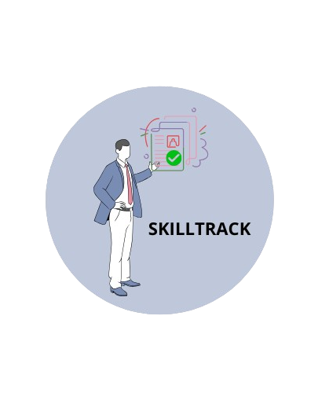

<h1 align="center">
  <br>
  <a href=""></a>
  <br>
  SkillTrack
  <br>
</h1>

<h4 align="center">Une application destinée aux RH pour vous simplifier la vie.<br>
Elle permet de catégoriser les CV des salariés selon leurs compétences afin de les répertorier et les présenter plus rapidement.</h4>

<!--<p align="center">
  <a href="https://badge.fury.io/js/electron-markdownify">
    
  </a>
  <a href="https://gitter.im/amitmerchant1990/electron-markdownify"></a>
  <a href="https://saythanks.io/to/bullredeyes@gmail.com">
      
  </a>
  <a href="https://www.paypal.me/AmitMerchant">
    
  </a>
</p> -->

<p align="center">
  <a href="#fonctionnalités-principales">Liste des fonctionnalités</a> •
  <a href="#utilisation">Comment utiliser l'application</a> •
  <a href="#visiter-l'application">Visiter l'application</a> •
  <a href="#credits">Credits</a> •
  <a href="#license">Licence</a>
</p>

<!-- [screenshot](https://raw.githubusercontent.com/amitmerchant1990/electron-markdownify/master/app/img/markdownify.gif) -->

## 📌 Fonctionnalités principales

### 1️⃣ Gestion des CV et des salariés

- Ajouter, modifier, supprimer un salarié.
- Importer des CV (PDF, DOCX) et extraire les compétences.
- Associer un salarié à des compétences spécifiques.
- Rechercher un salarié par nom, compétence ou autre critère.

### 2️⃣ Catégorisation et recherche des compétences

- Création et gestion de catégories de compétences (techniques, soft skills…).
- Filtrage des salariés selon leurs compétences.

### 3️⃣ Présentation et export des profils

- Génération de profils formatés (PDF, HTML).
- Export des salariés et de leurs compétences sous format Excel.
- Création d’une fiche de présentation rapide.

### 4️⃣ Gestion des utilisateurs et des accès

- Authentification (connexion, inscription).
- Différents rôles (RH, Manager, Administrateur).
- Gestion des droits d'accès.

### 5️⃣ Tableau de bord et statistiques

- Visualisation des compétences les plus courantes.
- Répartition des salariés par catégorie de compétence.
- Historique des modifications et interactions.

## Utilisation

Pour cloner et lancer cette application, vous avez besoin de
[Git](https://git-scm.com) and [Python](https://www.python.org/downloads/) installés sur votre PC. Puis, en ligne de commande :

```bash
# Cloner le repository
$ git clone

# Aller dans le repository
$ cd

# Créer l'environnement virtuel
$ python -m venv venv

# Activer l'environnement
$ source venv/bin/activate

# Installer les dépendances
$ pip install --r requirements.txt

# Lancer l'application depuis votre terminal
$ python manage.py runserver
```

## Development

Install [Docker](https://docs.docker.com/install/) and [Docker-Compose](https://docs.docker.com/compose/). Start your virtual machines with the following shell command:

`docker-compose up --build`

If all works well, you should be able to create an admin account with:

`docker-compose run backend python manage.py createsuperuser`

## Visiter l'application

Vous pouvez retouver l'application en ligne sur le lien : [SkillTrack](https://git-scm.com)

## Credits

## Support

## License

MIT

---

> [Alexiane Barbe](https://alexianeba.github.io/portfolio/) &nbsp;&middot;&nbsp;
> GitHub [@AlexianeBA](https://github.com/AlexianeBA) &nbsp;&middot;&nbsp;
